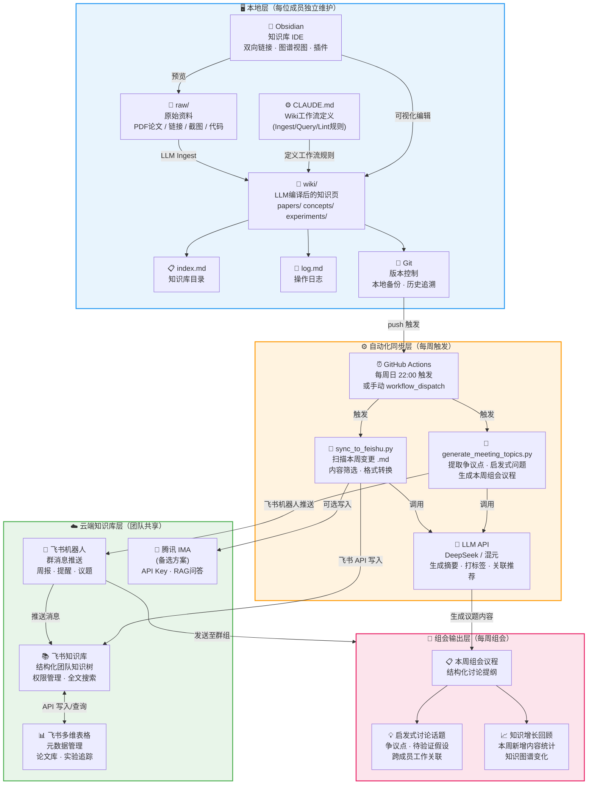
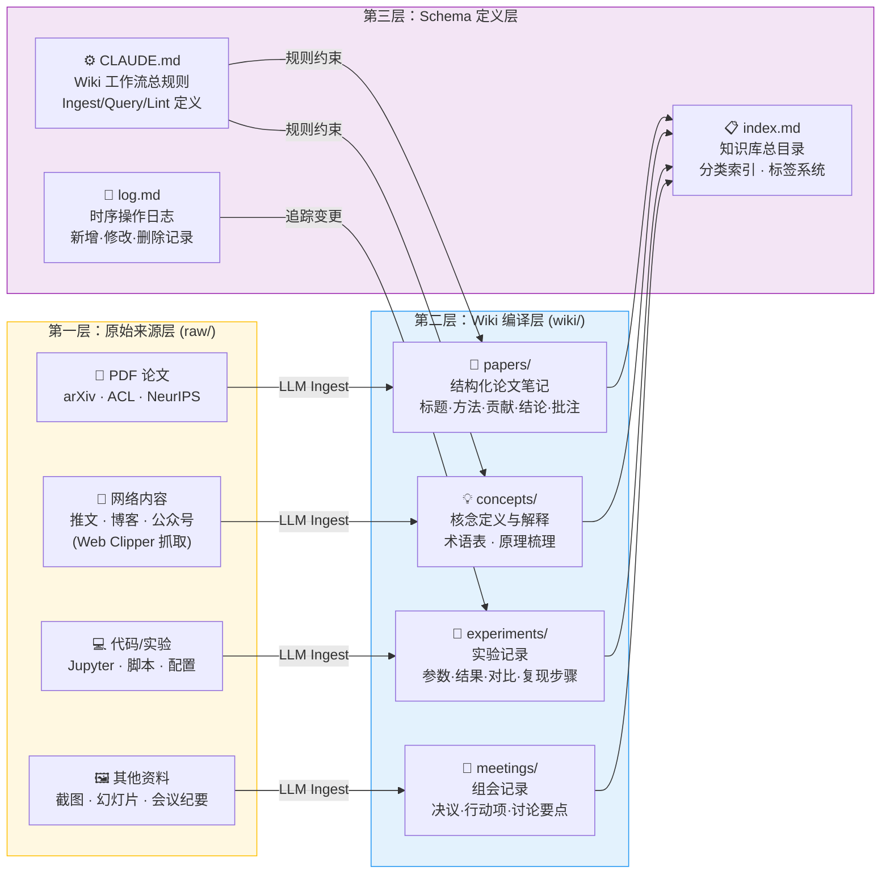
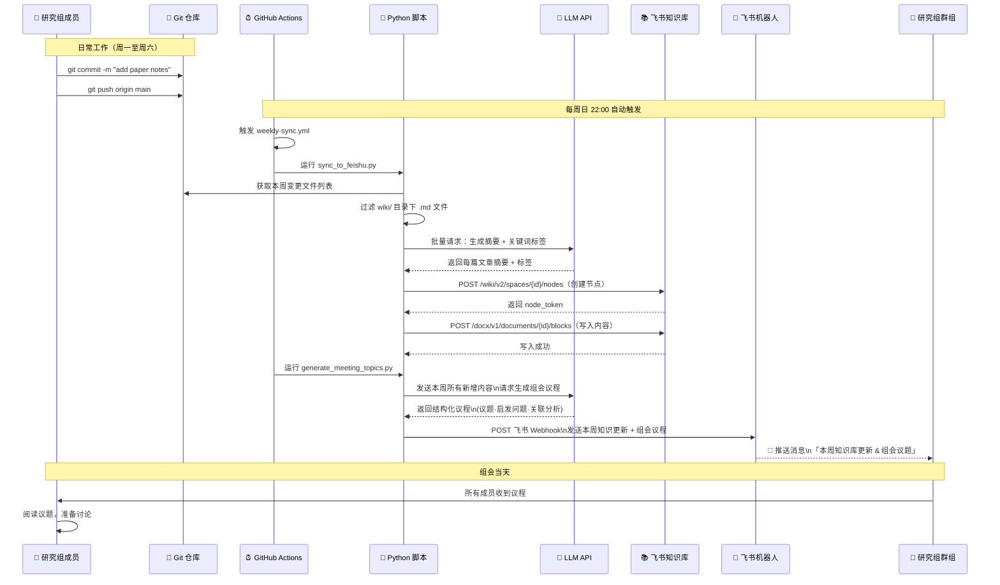
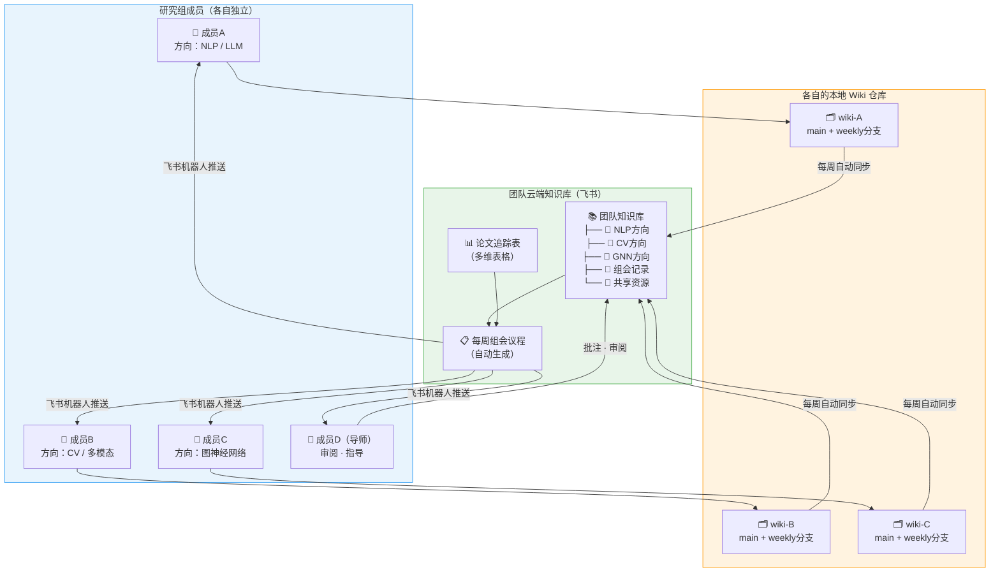
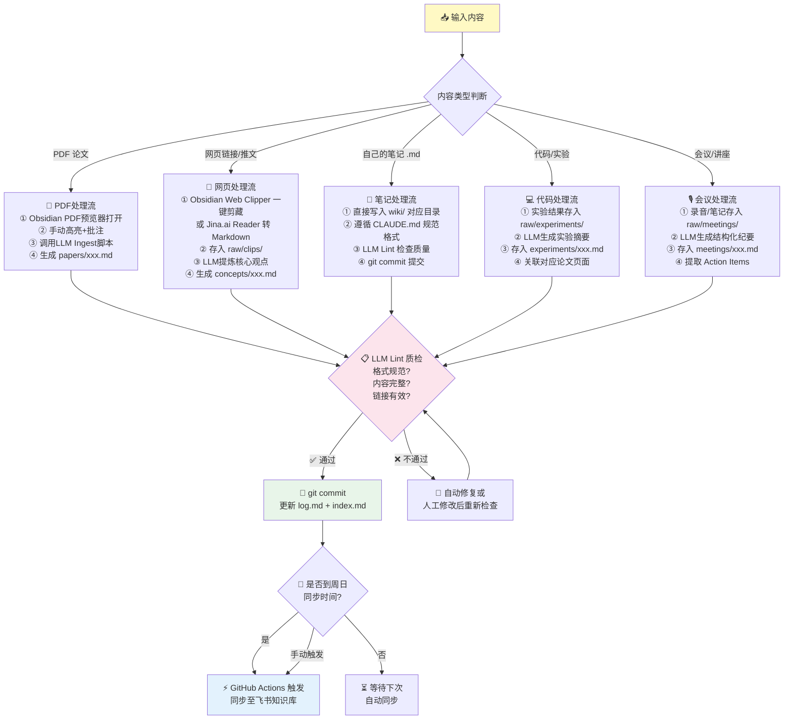
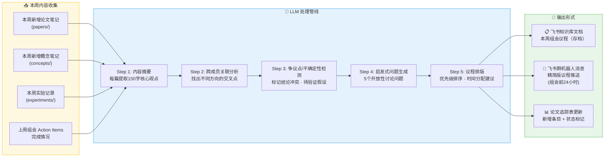

# 研究组本地/云端协同知识库 — 架构图与工作流程图

---

## 一、整体系统架构图

```mermaid
graph TB
    subgraph LOCAL["🖥️ 本地层（每位成员独立维护）"]
        RAW["📁 raw/\n原始资料\nPDF论文 / 链接 / 截图 / 代码"]
        WIKI["📝 wiki/\nLLM编译后的知识页\npapers/ concepts/ experiments/"]
        INDEX["📋 index.md\n知识库目录"]
        LOG["📒 log.md\n操作日志"]
        CLAUDE_MD["⚙️ CLAUDE.md\nWiki工作流定义\n(Ingest/Query/Lint规则)"]
        OBS["🔮 Obsidian\n知识库 IDE\n双向链接 · 图谱视图 · 插件"]
        GIT["🔀 Git\n版本控制\n本地备份 · 历史追溯"]

        RAW -->|LLM Ingest| WIKI
        WIKI --> INDEX
        WIKI --> LOG
        CLAUDE_MD -->|定义工作流规则| WIKI
        OBS -->|可视化编辑| WIKI
        OBS -->|预览| RAW
        WIKI --> GIT
    end

    subgraph SYNC["⚙️ 自动化同步层（每周触发）"]
        GA["⏰ GitHub Actions\n每周日 22:00 触发\n或手动 workflow_dispatch"]
        PY_SYNC["🐍 sync_to_feishu.py\n扫描本周变更 .md\n内容筛选 · 格式转换"]
        LLM["🤖 LLM API\nDeepSeek / 混元\n生成摘要 · 打标签 · 关联推荐"]
        PY_MEET["🐍 generate_meeting_topics.py\n提取争议点 · 启发式问题\n生成本周组会议程"]

        GA -->|触发| PY_SYNC
        GA -->|触发| PY_MEET
        PY_SYNC -->|调用| LLM
        PY_MEET -->|调用| LLM
    end

    subgraph CLOUD["☁️ 云端知识库层（团队共享）"]
        FEISHU_WIKI["📚 飞书知识库\n结构化团队知识树\n权限管理 · 全文搜索"]
        FEISHU_BOT["🤖 飞书机器人\n群消息推送\n周报 · 提醒 · 议题"]
        FEISHU_DB["📊 飞书多维表格\n元数据管理\n论文库 · 实验追踪"]
        IMA["🧠 腾讯 IMA\n(备选方案)\nAPI Key · RAG问答"]

        FEISHU_WIKI <-->|API 写入/查询| FEISHU_DB
        FEISHU_BOT -->|推送消息| FEISHU_WIKI
    end

    subgraph OUTPUT["📢 组会输出层（每周组会）"]
        AGENDA["📋 本周组会议程\n结构化讨论提纲"]
        TOPICS["💡 启发式讨论话题\n争议点 · 待验证假设\n跨成员工作关联"]
        REVIEW["📈 知识增长回顾\n本周新增内容统计\n知识图谱变化"]

        AGENDA --> TOPICS
        AGENDA --> REVIEW
    end

    %% 跨层连接
    GIT -->|push 触发| GA
    PY_SYNC -->|飞书 API 写入| FEISHU_WIKI
    PY_SYNC -->|可选写入| IMA
    PY_MEET -->|飞书机器人推送| FEISHU_BOT
    FEISHU_BOT -->|发送至群组| OUTPUT
    LLM -->|生成议题内容| AGENDA

    style LOCAL fill:#e8f4fd,stroke:#2196F3,stroke-width:2px
    style SYNC fill:#fff3e0,stroke:#FF9800,stroke-width:2px
    style CLOUD fill:#e8f5e9,stroke:#4CAF50,stroke-width:2px
    style OUTPUT fill:#fce4ec,stroke:#E91E63,stroke-width:2px
```

---

## 二、本地知识库三层架构（参考 Karpathy LLM Wiki）

```mermaid
graph LR
    subgraph L1["第一层：原始来源层 (raw/)"]
        P1["📄 PDF 论文\narXiv · ACL · NeurIPS"]
        P2["🔗 网络内容\n推文 · 博客 · 公众号\n(Web Clipper 抓取)"]
        P3["💻 代码/实验\nJupyter · 脚本 · 配置"]
        P4["🖼️ 其他资料\n截图 · 幻灯片 · 会议纪要"]
    end

    subgraph L2["第二层：Wiki 编译层 (wiki/)"]
        W1["📝 papers/\n结构化论文笔记\n标题·方法·贡献·结论·批注"]
        W2["💡 concepts/\n核念定义与解释\n术语表 · 原理梳理"]
        W3["🧪 experiments/\n实验记录\n参数·结果·对比·复现步骤"]
        W4["📅 meetings/\n组会记录\n决议·行动项·讨论要点"]
    end

    subgraph L3["第三层：Schema 定义层"]
        S1["⚙️ CLAUDE.md\nWiki 工作流总规则\nIngest/Query/Lint 定义"]
        S2["📋 index.md\n知识库总目录\n分类索引 · 标签系统"]
        S3["📒 log.md\n时序操作日志\n新增·修改·删除记录"]
    end

    P1 -->|LLM Ingest| W1
    P2 -->|LLM Ingest| W2
    P3 -->|LLM Ingest| W3
    P4 -->|LLM Ingest| W4

    W1 --> S2
    W2 --> S2
    W3 --> S2
    W4 --> S2

    S1 -->|规则约束| W1
    S1 -->|规则约束| W2
    S3 -->|追踪变更| W3

    style L1 fill:#fff8e1,stroke:#FFC107
    style L2 fill:#e3f2fd,stroke:#2196F3
    style L3 fill:#f3e5f5,stroke:#9C27B0
```

---

## 三、每周自动化同步工作流

```mermaid
sequenceDiagram
    participant Dev as 👤 研究组成员
    participant Git as 🔀 Git 仓库
    participant GA as ⏰ GitHub Actions
    participant PY as 🐍 Python 脚本
    participant LLM as 🤖 LLM API
    participant FS as 📚 飞书知识库
    participant Bot as 🤖 飞书机器人
    participant Group as 👥 研究组群组

    Note over Dev,Git: 日常工作（周一至周六）
    Dev->>Git: git commit -m "add paper notes"
    Dev->>Git: git push origin main

    Note over GA,Group: 每周日 22:00 自动触发
    GA->>GA: 触发 weekly-sync.yml
    GA->>PY: 运行 sync_to_feishu.py

    PY->>Git: 获取本周变更文件列表
    PY->>PY: 过滤 wiki/ 目录下 .md 文件
    PY->>LLM: 批量请求：生成摘要 + 关键词标签

    LLM-->>PY: 返回每篇文章摘要 + 标签
    PY->>FS: POST /wiki/v2/spaces/{id}/nodes（创建节点）
    FS-->>PY: 返回 node_token
    PY->>FS: POST /docx/v1/documents/{id}/blocks（写入内容）
    FS-->>PY: 写入成功

    GA->>PY: 运行 generate_meeting_topics.py
    PY->>LLM: 发送本周所有新增内容\n请求生成组会议程
    LLM-->>PY: 返回结构化议程\n(议题·启发问题·关联分析)
    PY->>Bot: POST 飞书 Webhook\n发送本周知识更新 + 组会议程

    Bot-->>Group: 📢 推送消息\n「本周知识库更新 & 组会议题」

    Note over Dev,Group: 组会当天
    Group->>Dev: 所有成员收到议程
    Dev->>Dev: 阅读议题，准备讨论
```

---

## 四、多成员协作流程图

```mermaid
graph TD
    subgraph MEMBERS["研究组成员（各自独立）"]
        M1["👤 成员A\n方向：NLP / LLM"]
        M2["👤 成员B\n方向：CV / 多模态"]
        M3["👤 成员C\n方向：图神经网络"]
        M4["👤 成员D（导师）\n审阅 · 指导"]
    end

    subgraph REPOS["各自的本地 Wiki 仓库"]
        R1["🗂️ wiki-A\nmain + weekly分支"]
        R2["🗂️ wiki-B\nmain + weekly分支"]
        R3["🗂️ wiki-C\nmain + weekly分支"]
    end

    subgraph TEAM_CLOUD["团队云端知识库（飞书）"]
        TW["📚 团队知识库\n├── 📂 NLP方向\n├── 📂 CV方向\n├── 📂 GNN方向\n├── 📂 组会记录\n└── 📂 共享资源"]
        TB["📊 论文追踪表\n（多维表格）"]
        TM["📋 每周组会议程\n（自动生成）"]
    end

    M1 --> R1
    M2 --> R2
    M3 --> R3

    R1 -->|每周自动同步| TW
    R2 -->|每周自动同步| TW
    R3 -->|每周自动同步| TW

    TW --> TM
    TB --> TM

    TM -->|飞书机器人推送| M1
    TM -->|飞书机器人推送| M2
    TM -->|飞书机器人推送| M3
    TM -->|飞书机器人推送| M4

    M4 -->|批注 · 审阅| TW

    style MEMBERS fill:#e8f4fd,stroke:#2196F3
    style REPOS fill:#fff3e0,stroke:#FF9800
    style TEAM_CLOUD fill:#e8f5e9,stroke:#4CAF50
```

---

## 五、内容类型处理流程

```mermaid
flowchart TD
    INPUT["📥 输入内容"] --> TYPE{内容类型判断}

    TYPE -->|PDF 论文| PDF_FLOW["📄 PDF处理流\n① Obsidian PDF预览器打开\n② 手动高亮+批注\n③ 调用LLM Ingest脚本\n④ 生成 papers/xxx.md"]

    TYPE -->|网页链接/推文| WEB_FLOW["🔗 网页处理流\n① Obsidian Web Clipper 一键剪藏\n   或 Jina.ai Reader 转 Markdown\n② 存入 raw/clips/\n③ LLM提炼核心观点\n④ 生成 concepts/xxx.md"]

    TYPE -->|自己的笔记 .md| MD_FLOW["📝 笔记处理流\n① 直接写入 wiki/ 对应目录\n② 遵循 CLAUDE.md 规范格式\n③ LLM Lint 检查质量\n④ git commit 提交"]

    TYPE -->|代码/实验| CODE_FLOW["💻 代码处理流\n① 实验结果存入 raw/experiments/\n② LLM生成实验摘要\n③ 存入 experiments/xxx.md\n④ 关联对应论文页面"]

    TYPE -->|会议/讲座| MEET_FLOW["🎙️ 会议处理流\n① 录音/笔记存入 raw/meetings/\n② LLM生成结构化纪要\n③ 存入 meetings/xxx.md\n④ 提取 Action Items"]

    PDF_FLOW --> REVIEW{"📋 LLM Lint 质检\n格式规范?\n内容完整?\n链接有效?"}
    WEB_FLOW --> REVIEW
    MD_FLOW --> REVIEW
    CODE_FLOW --> REVIEW
    MEET_FLOW --> REVIEW

    REVIEW -->|✅ 通过| COMMIT["🔀 git commit\n更新 log.md + index.md"]
    REVIEW -->|❌ 不通过| FIX["🔧 自动修复或\n人工修改后重新检查"]
    FIX --> REVIEW

    COMMIT --> SYNC{"📅 是否到周日\n同步时间?"}
    SYNC -->|是| AUTO_SYNC["⚡ GitHub Actions 触发\n同步至飞书知识库"]
    SYNC -->|否| WAIT["⏳ 等待下次\n自动同步"]
    SYNC -->|手动触发| AUTO_SYNC

    style INPUT fill:#fff9c4
    style REVIEW fill:#fce4ec
    style COMMIT fill:#e8f5e9
    style AUTO_SYNC fill:#e3f2fd
```

---

## 六、LLM 驱动的组会议题生成流程

```mermaid
flowchart LR
    subgraph COLLECT["📥 本周内容收集"]
        C1["本周新增论文笔记\n(papers/)"]
        C2["本周新增概念笔记\n(concepts/)"]
        C3["本周实验记录\n(experiments/)"]
        C4["上周组会 Action Items\n完成情况"]
    end

    subgraph LLM_PROC["🤖 LLM 处理管线"]
        L1["Step 1: 内容摘要\n每篇提取150字核心观点"]
        L2["Step 2: 跨成员关联分析\n找出不同方向的交叉点"]
        L3["Step 3: 争议点/不确定性检测\n标记结论冲突 · 待验证假设"]
        L4["Step 4: 启发式问题生成\n5个开放性讨论问题"]
        L5["Step 5: 议程排版\n优先级排序 · 时间分配建议"]
    end

    subgraph OUTPUT2["📢 输出形式"]
        O1["📋 飞书知识库文档\n本周组会议程（存档）"]
        O2["💬 飞书群机器人消息\n精简版议程推送\n(组会前24小时)"]
        O3["📊 论文追踪表更新\n新增条目 + 状态标记"]
    end

    C1 --> L1
    C2 --> L1
    C3 --> L1
    C4 --> L1

    L1 --> L2
    L2 --> L3
    L3 --> L4
    L4 --> L5

    L5 --> O1
    L5 --> O2
    L5 --> O3

    style COLLECT fill:#fff8e1,stroke:#FFC107
    style LLM_PROC fill:#e3f2fd,stroke:#2196F3
    style OUTPUT2 fill:#e8f5e9,stroke:#4CAF50
```
